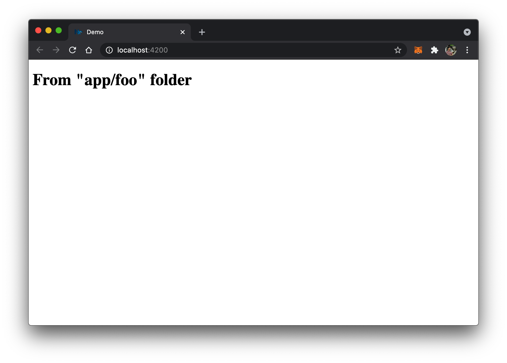
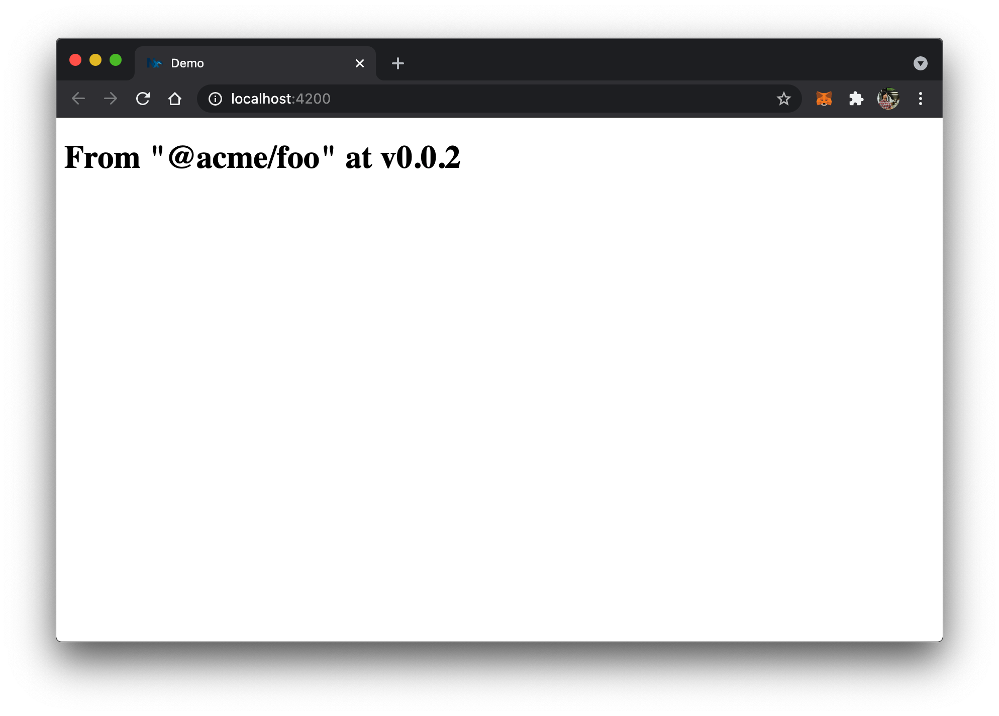

# SPIKE: Loading different versions behind configurations

This is a demo of using different configurations during build time to load different versions of the same Angular/Node package.

In this demo, there are three versions of the `FooModule`, which all have different implementations.

1. The "legacy" module is under the app's source folder at `apps/demo/src/app/foo`.
2. The new v1 module is installed as `@acme/foo` and is located at `third-party/packages/acme-foo-0.0.1.tgz`.


## TOC

* [Problem](#problem)
* [Solution](#solution)
  * [Demonstration: running the app](#demonstration-running-the-app)
* [Verification and Cleanup](#verification-and-cleanup)
* [Conclusion](#conclusion)
* [Further research](#further-research)
* [Appendix A: on multiple node package versions](#appendix-a-on-multiple-node-package-versions)
* [Appendix B: on published npm packages](#appendix-b-on-published-npm-packages)

## Problem

An internal "lib" needs to be extracted from the app folder and into its own npm package.  Say, we are extracting `apps/demo/src/app/foo` folder into an npm package `@acme/foo` that can be installed via `npm install third-party/packages/acme-foo-<current version>>.tgz`.

Due to a **trunk-based** development approach, we need upgrade the package in the trunk branch in order to deploy and test it in lower environments. However, by merging the package we are preventing further deployments from trunk to production unless we do a rollback.

**Assumption:** There are no E2E tests, or the E2E tests are not sufficient to verify the package change.

## Solution

**Assumption**: The public API of `FooModule` does not contain any breaking changes, thus the app code does not need to be changed between updates.

We keep both the legacy "lib" folder and the newly extracted package in trunk, then use `fileReplacements` during build to switch between the versions.

More concretely, the `AppModule` (`apps/demo/src/app/app.module.ts`) imports the `ChildModule` from `apps/demo/src/app/child.module.ts`, which is using the newest v2 version of `FooModule`.

Then, in `angular.json` we specify different configurations for the `demo` app's `build` target.

```json
{
  ...
  "projects": {
    "demo": {
      ...
      "architect": {
        "build": {
          "builder": "@angular-devkit/build-angular:browser",
          "options": {
            ...
          },
          "configurations": {
            "prd": {
              "fileReplacements": [
                {
                  "replace": "apps/demo/src/app/child.module.ts",
                  "with": "apps/demo/src/app/child.legacy.module.ts"
                }
              ],
              ...
            },
            "dev": {
              "fileReplacements": [
                {
                  "replace": "apps/demo/src/app/child.module.ts",
                  "with": "apps/demo/src/app/child.v1.module.ts"
                }
              ],
              ...
            }
          }
        }
      }
    }
  }
}
```

The the `child.legacy.module.ts` file is the same as `child.module.ts`, however it imports from `./foo/foo.module.ts` rather than `@acme/foo`.

Therefore, by specifying `--configuration prd` during the build we will load the legacy module rather than the newly extracted one.


### Demonstration: running the app

To run the `prd` configuration with legacy module:

```bash
nx serve demo --configuration prd
```



To run the normal configuration with the extracted module:

```bash
nx serve demo
```



The configuration option also works when building and deploying the app.

```
nx build demo --configuration prd  # legacy
nx build demo                      # new 
```

## Verification and Cleanup

The deployment pipeline needs to support specifying the different configurations (i.e. `prd` or none). Then the app with the new `@acme/foo` package can be deployed to a lower environment and tested by the QAT team. 

Once the change is verified to be working, we can delete the old `apps/demo/src/app/foo` folder, the `child.legacy.module.ts` file, and the `fileReplacements` entry.

## Conclusion

Using the `fileReplacements` option in `angular.json`, we can adhere to trunk-based development while still supporting multiple versions of the same package.

## Further research

As mentioned in the *verification* section, there needs to be a way during the deployment pipeline to specify `--configuration <prd>` option depending on the environment we are deploying to.


## Appendix A: on multiple node package versions

The approach of using file replacements can be extended to multiple versions of the same node package.

You can see this in action by running with `--configuration dev`

```bash
nx serve demo --configuration dev
```


## Appendix B: on published npm packages

This demo shows how using file replacements enable the app to load different versions of the same module. This technique can also
be applied for packages published to `npm` since you can specify different versions in `package.json` as follows.

```json
{
  "dependencies": {
    "ngx-spinner-11": "npm:ngx-spinner@11.0.0",
    "ngx-spinner-10": "npm:ngx-spinner@10.0.0",
    ...
  }
}
```

The above will install the `ngx-spinner` package under aliases of `ngx-spinner-10` and `ngx-spinner-11` so we can import them in the corresponding Angular modules.
